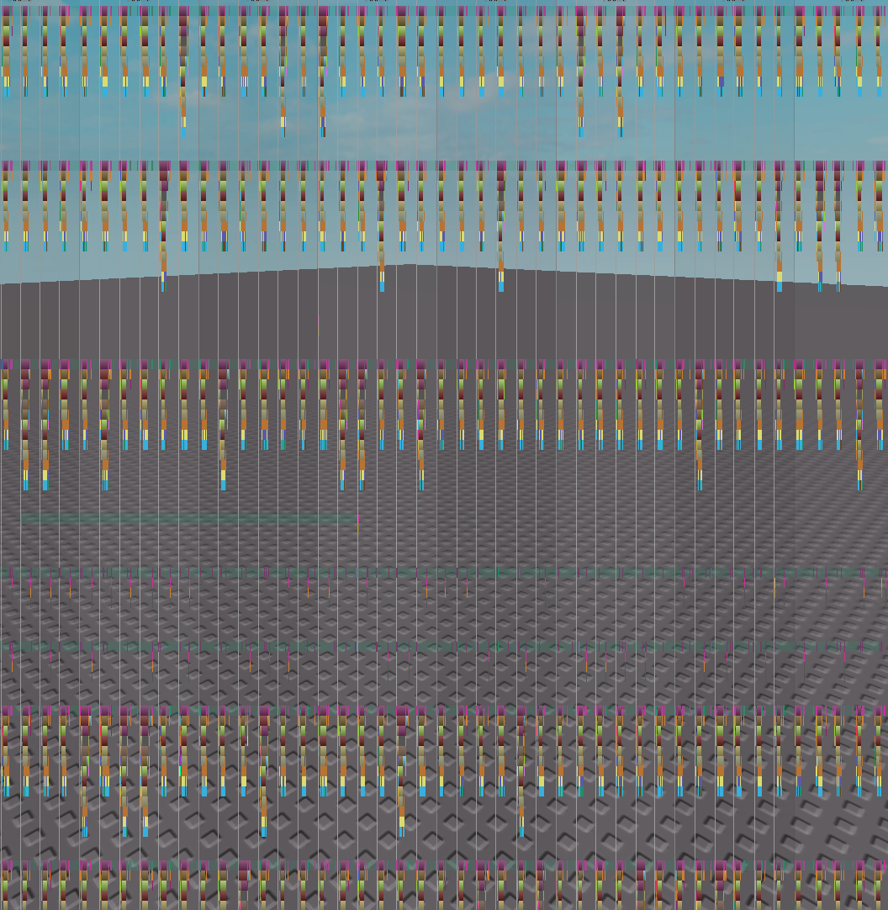

# Parallel-Jecs

Small demo of running a query in parallel and syncing back to [Jecs](https://github.com/Ukendio/jecs).

What's the current performance of parallel vs serial (as of 19-07-2025)?
* Best Case
    - **This benchmark is very synthetic, and doesn't represent real world use!**
    - 10000 entities, each raycasting every step (heavy work)
    - Parallel: 4-6ms
    - Serial: 14-15ms
* Worst Case
    - **This benchmark is very synthetic, and doesn't represent real world use!**
    - 100000 entities, updating a single field (very light work)
    - Parallel: 26ms
    - Serial: 22ms

## Installation

There's a lot of different CLI's tools used, consider using [Rokit](https://github.com/rojo-rbx/rokit) to install them.

1. Clone repository
2. Install toolchain using `rokit install`
3. Get Jecs with wally `wally install`
5. Run watch with Lune `lune run .\scripts\watch`
6. Connect with Rojo in a Roblox Studio

[Darklua](https://github.com/seaofvoices/darklua) is needed to transform string required for now™. 

You can optionally run `wally-package-types.exe --sourcemap sourcemap.json .\Packages\` to generate types.

## Usage

You can play with the `PARALLEL` flag and number of `WORKERS` in [Client.client.luau](src/client/Client.client.luau).

## Contributing

This is a certified demo and true programmer project. Join the discussion at the [Roblox OSS Discord](https://discord.com/invite/wH5ncNS) in [this](https://discord.com/channels/385151591524597761/1394705190137102376) thread.

## License

This project is licensed under the MIT License - see the [LICENSE](LICENSE) file for details.
